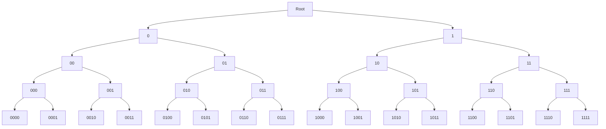
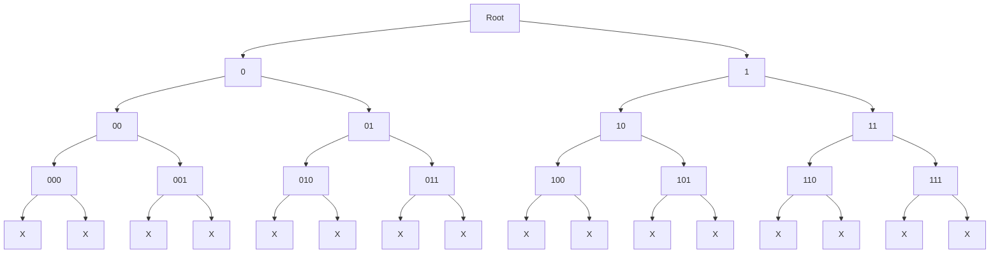
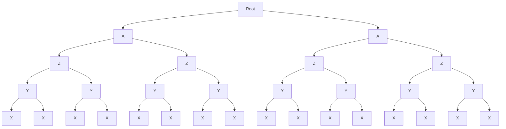
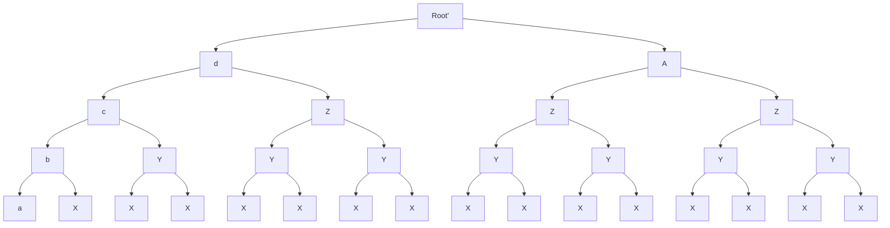

There are two main elements to synchronization in Zcash:
- trial decryption
- note witness maintenance

Warp 2 improves on the second element.

## Recap

When you spend a shielded note, the transaction needs to contain
a zk proof about your knowledge of that note. To do so, the wallet
must keep track of a data structure called the note commitment merkle
tree and compute a merkle proof.

## Note Commitment Merkle Tree

Every transaction output has a unique commitment hash. The Note Commitment Merkle Tree
(NCMT) is an append-only tree that contains all of them in the order they were created.
The NCMT has a fixed height of 32 for a total of 2^32 notes.

In the following, we will use a height of 4 instead. The tree has 2^4 = 16 notes.
The notes are placed at the bottom, as leaves.

Here's our example NCMT:



The leaves are numbered 0000, 0001, 0010, etc. in binary. In decimal, they have index 0, 1, 2, ...
up to 15.

In the beginning, the tree is empty but because we always work with a full tree we use a 
placeholder value for the note commitments that are not added yet.
The placeholder value is chosen so that it cannot be a real note commitment.

Let's call this value "X".



By definition, the value of a node is the hash of the combination of the two children.
Let's call this H(L, R). When we calculate the values of the rest of the tree,



Basically, the value at a given level is the same because it is H(x, x) where x is the value at 
the level below.

Actually we can calculate the node value at any given height iteratively

```math
$$ N_i = H(N_{i-1}, N_{i-1}) $$
```

This shows that for an empty tree, the calculation can be done in linear time of the height, i.e.
logarithmic time of the number of notes.

But obviously, the tree is not empty.

Let's say that we have inserted 1 note.




Now the node that combines note #0 and note #1 is H(a, X) whichi is different from Y.
The difference "propagates" up, and we have different values b, c, d and a different Root'.

## Merkle Proof

The Merkle Proof is the series of hashes that allow a verifier to check that the value we
give, belongs to the tree.

Let's say that the verifier has the entire tree. We give a note commitment (NC) and we
claim it belongs to the tree.

To prove that it is true, we also give the values of every *other* node on the path to the root.
In this case, it would be [X, Y, Z, A]. Then the verifier can compute the parent nodes himself
b = H(a, X), c = H(b, Y), d = H(c, Z), Root' = H(d, A).
If he gets the same Root', the proof checks out.

