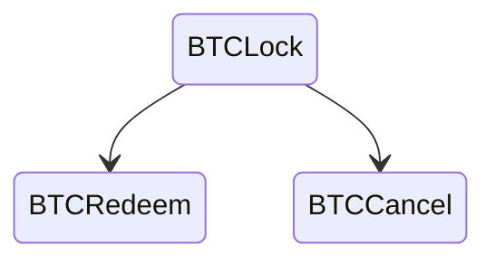
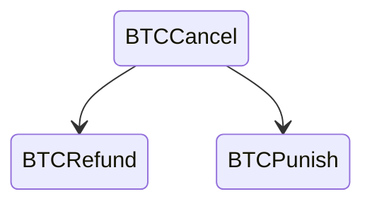
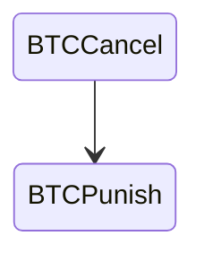

The Zwap protocol must also support cases when either party behaves improperly.
For example, Bob could lock the BTC but Alice walked away. Without a contingency
plan, Bob's BTC would be stuck forever.

In this section, we'll cover all the possible "bad" cases when the ZSwap does not
complete.

## Case 0: Bob does not lock BTC

- Bob has to start the protocol
- If he does not publish BTC, Alice walks away
- Nothing happened

## Case 1: Bob locked BTC
1. Bob locks BTC, Alice does not lock ZEC. Bob wants to cancel
2. Bob locks BTC Alice locks ZEC but Bob does not send the signature adaptor. Alice wants to cancel
3. Bob locks BTC Alice locks ZEC but sends the signature adaptor, Alice does not redeem. Bob wants to cancel

BTCLock has a second redeem condition that activates after a certain number of blocks.
Either Alice or Bob can use their pre-exchanged signatures and move the funds
to a new address.

BTCCancel requires:
- Signatures A & B (sent before but not usable because of the time lock)
- Time/Height elapsed

## Case 2: Bob Refunds

Now Bob has to do the refund. 
- The refund is a transaction that moves the BTC back to an address he owns. 
- Both Alice & Bob must sign
- Bob can sign
- Bob needs a signature from Alice
- Alice has sent a signature adaptor to Bob *before* Bob made the first transaction
- The signature adaptor decrypts with Bob Secret
- Bob redeems BTCCancel and reveals his secret
- Alice observes the blockchain and extracts Bob Secret from the signature
- Alice recovers the ZEC

## Case 3: Bob walks away

This happens if Bob does not do the refund in a reasonable time. 

- Alice and Bob agreed on a second time lock for the refund
- BTCCancel has a second spend condition that actives after the 2nd time lock
- BTCPunish is a multi-sig with both signatures pre-exchanged (like BTCCancel)

If Bob takes too long, Alice can redeem the BTC without providing her Secret key.
In this case, the ZEC are burnt since no one has both secrets.
