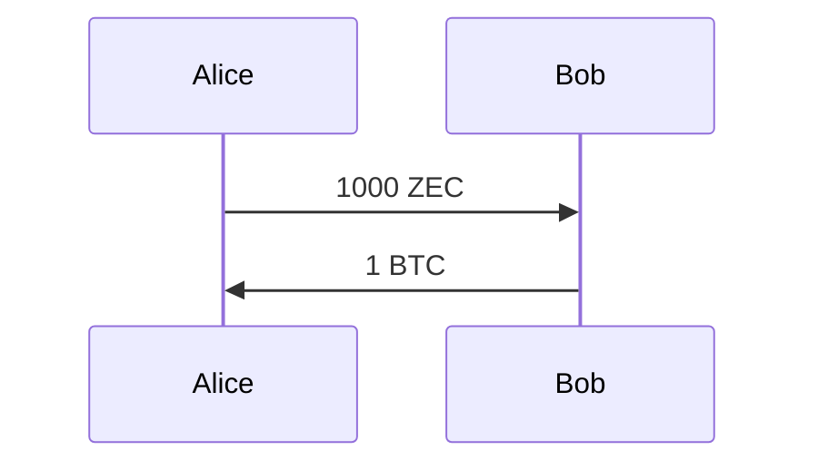
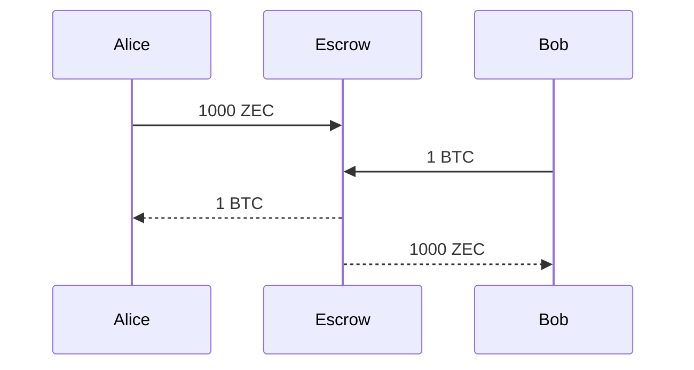

Suppose Alice has ZEC and Bob has BTC.
They agree on a exchange of 
- Alice offers 1000 ZEC
- Bob offers 1 BTC

## Option 1: OTC - Over the Counter

- Alice sends 1000 ZEC to Bob's wallet
- Bob sends 1 BTC to Alice's wallet

Swap is done.

Pro:
- Simple
- Fastest
- Minimum fees / transactions
- No third party involved -> High Privacy

Con:
- They must know each other
- and trust each other

## Option 2: Escrow Service

- Alice and Bob hire the service of a third party
- They first send the funds to the Escrow agent
- When he confirms receiption of both Alice's and 
Bob's funds, he unlocks the funds and completes
the swap

Pro:
- Alice and Bob do not need to know and trust each other,
but they need to trust the Escrow service
- Fast
- Only 4 transactions required
- Low tx fees
- Simple to execute

Con:
- Must trust the Escrow service
- Escrow may take a fee
- Escrow service knows the details of the swap
- Lower privacy

## Option 3: Zwap - Atomic Cross Chain Swap

Pro:
- Peer to peer, no third-party involved
- Anonymous
- Shielded on Zcash
- High Privacy
- Atomic
    - All or nothing
    - No trust required

Con:
- More complex to execute
- Higher fee but only in case of cancellation & refund, i.e. bad scenario
- Slower 

