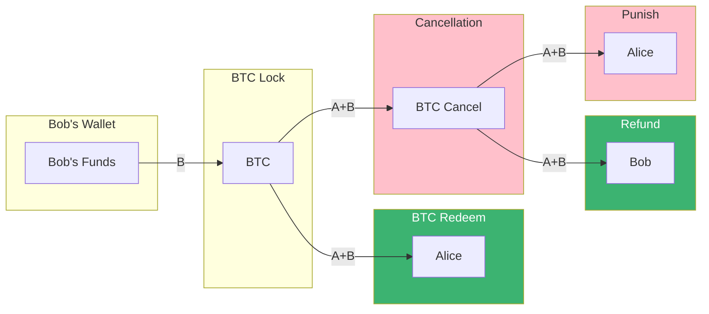
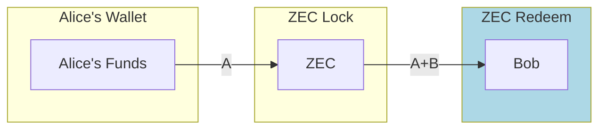

- Transactions in Pink are time locked, the signatures were provided off-chain before any on-chain transaction. **This is possible because transaction ID are non-malleable and deterministic.**
- Transactions in Green reveal the secret key through the signature adaptor

- Transactions in Blue can be signed once the second secret key is revealed by the signature from the corresponding green transaction.
