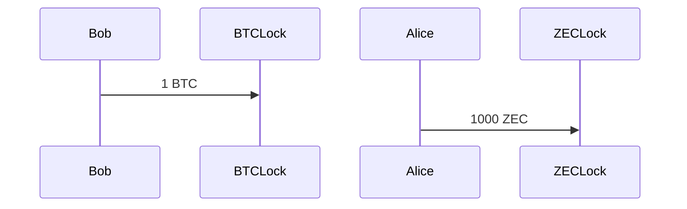

- Same number of transactions: 4
- BTCLock is a multi-sig & time locked address
- ZECLock is a shielded multi-sig address (FROST like)

Addresses are determined off-chain and unsigned transactions are built
beforehand. The signatures may be missing or the transactions are simply
not yet published.

## Tx 1: Fund the BTC Lock

- Bob moves 1 BTC to the BTC P2SH address
- The script is
    1. Multi-sig Alice + Bob
    2. OR enough time has passed (time-lock) and Multi-sig Alice + Bob
    pre-signed
- 1 & 2 use different public keys therefore the signatures cannot be swapped
- Alice wants to redeem the BTC
- Alice can sign 1. with her secret key
- Bob needs to sign 1. as well
- **Bob does not want to sign without getting ZEC**

## Tx 2: Fund the ZEC lock

- Alice notices Tx. 1 and posts Tx 2 on Zcash blockchain
- nsk, nk, dk, ovk are pre-agreed
- ask = secret Alice + secret Bob
- *same secret* as for Bitcoin
- neither Alice or Bob have the full secret key
- Bob has 1 secret key
- Bob needs Alice secret key
- **Alice does not want to give her secret key without getting BTC**

This issue can be solved with Signature Adaptors
