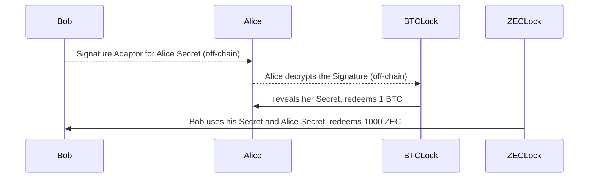

- Same number of transactions: 4
- BTCLock is a multi-sig & time locked address
- ZECLock is a shielded multi-sig address (FROST like)

Addresses are determined off-chain and unsigned transactions are built
beforehand. The signatures may be missing or the transactions are simply
not yet published.

## Exchange 1: Bob sends a signature adaptor

- Bob gives a signature adaptor that unlocks the BTC
with the condition that Alice reveals her secret key for ZEC

## Tx 3: Alice redeems the BTC 
- Alice decrypts the signature adapter with her secret key
and forms a sigature for BTC Lock
- Alice redeems BTC Lock by adding her signature and Bob's signature

## Tx 4: Bob redeems the ZEC
- Bob monitors the blockchain and notices the signature
- Bob extracts the Alice secret
- Bob combines his secret with Alice secret
- Bob has the secret key to ZEC Lock
- Bob can redeem the ZEC (or leave it there)

