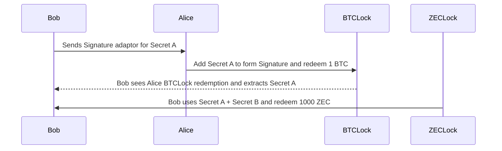

## Problem


Give a signature that can only be used if a secret key is
revealed at the same time.


## Usage



## Schnorr Signature

### Sign

```math
Let's say we want to sign the message with hash $m$. We have the secret key $p$ matching the public key $P$ such as $P = p.G$ (where $G$ is the Generator point).
First we randomly pick a new secret $r$ and compute the public key for it. 
$$R = r.G$$
```

```math
Then we use the hashing function $H$ and calculate
$$s = r + H(R|m).p $$
```

```math
The signature is $(s, R)$
```

### Verify

```math
To verify, we need to have the message, the public key and the signature:
$(m, s, R, P)$
```

Then we calculate
```math
$$ X = R + H(R|m).P $$
```

```math
The signature is valid if $X = s.G$
```

## Signature Adaptor

```math
Bob wants the secret key $t$ from Alice in exchange for a signature of BTC lock.
He knows the public key $T$.
```

```math
Bob makes a "signature" with a $R + T$ in the hash instead of $R$.
```

```math
$$ s = r + H(R+T|m).p $$
```

This is *NOT* a signature because it will not validate because it should be either
```math
$$ s_x = r + t + H(R+T|m).p $$
$$ s_y = r  + H(R|m).p $$
```

```math
But Alice can "fix" the signature by adding $t$ that she knows.
$$ s + t = s_x $$
```

```math
When she publishes her transaction, the signature is available on
the blockchain. Bob can get it and recover 
$$ t = s_x - s $$
```

This provides a mechanism for atomically allowing Alice and Bob
to redeem their funds.
